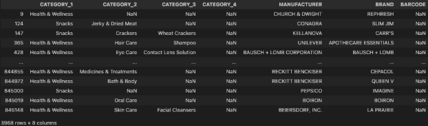

Email to product leader

Data Quality Issues & Request for Input on New Datasets

Hi \[Name of Stakeholders\],

I’m working on cleaning and analyzing three new datasets that could provide actionable insights about sales and user behaviour. I would like to share some updates on my investigation, as well as asking for your help to consolidate the data.

The three datasets are about our users, products and transactions. User dataset includes details like demographic and join dates, and Product dataset includes details like barcode identifier, category, sub-category, manufacturer and brand. Transaction dataset include every transaction taken place from 2024-06-12 to 2024-09-08, with details like purchase date, store name, user id, quantity and sales amount. The transaction dataset also links user dataset and product dataset together. 

However there are some data quality issues. Some were resolved during the process of data cleaning, but others require team collaboration to ensure we can fully leverage the data to meet our OKRs.

**Data Quality Issues**  
Here is a summary of some critical data quality issues:

1. **Mismatch in USER\_ID and BARCODE across the three datasets**

There is a significant number of USER\_ID mismatches between user dataset and transactions dataset, and BARCODE mismatches between product dataset and transactions dataset. It means that some transaction records by certain users cannot be mapped with the user information, and transaction records of certain products cannot be mapped with product information. This would prevent us from exploring the insights from all transactions, as we could not identify the users and products they purchased.

**Request:** Could the data engineering team help verify whether these discrepancies stem from missing records in the source database or issues in the data extraction process? Understanding this would help determine whether we need to update our data sources or adjust our integration process.

2. **Products with missing BARCODE**

As shown below, there are 3968 products that are missing their BARCODEs. We would need to backfill the BARCODE, or we could not identify these products in transactions, hence analyzing their sales records.  

**Request:** Could the merchandising team please help backfill the missing BARCODEs?

3. **Products with missing values or invalid terms in MANUFACTURER and BRAND**

As shown in the below screenshot, there are a significant amount of missing values and invalid terms in both MANUFACTURER and BRAND. I have cleaned the invalid terms by grouping them as ‘UNKNOWN MANUFACTURER’ and ‘UNKNOWN BRAND’ for now. But it would still require team efforts to backfill the values, or we could not analyze the performance of all manufacturers and brands.  

**Request:** Could the merchandising team confirm whether there is an internal reference list to backfill these values? Or it’d be great if you could provide the source.

**Outstanding Questions**  
Here are some outstanding questions regarding the datasets, and it would be great if any team could provide some insights to help solve them.

1. **Relationship between PLACEHOLDER MANUFACTURER and PRIVATE LABEL**

I also noticed the relationship between PLACEHOLDER MANUFACTURER and PRIVATE LABEL. Whenever the BRAND is ‘PRIVATE LABEL’, the MANUFACTURER is ‘PLACEHOLDER MANUFACTURER’. However it is not the same case vice versa. 

My questions are:

1. What is PLACEHOLDER MANUFACTURER?  
2. What is the business logic between these two variables?

Understanding these would help me apply an efficient logic to handle their relationship, hence analyzing their impact to our business.

2. **Transactions with missing values or invalid terms in FINAL\_QUANTITY & FINAL\_SALE** 

As shown in the below example, many rows of transactions have ‘zero’ in FINAL\_QUANTITY or empty FINAL\_SALE.  

During my data cleaning process, I assumed that the empty values in FINAL\_SALE are indeed the bundled sales item. Because every row with an empty value in FINAL\_SALE is paired with a row with identical RECEIPT\_ID, USER\_ID, and BARCODE, and they have a valid FINAL\_SALE. Therefore I have now cleaned the FINAL\_SALE column by replacing the empty value with ‘0’. It would be much appreciated if the sales team could confirm my assumption by cross-checking the RECEIPT\_ID and BARCODE in the above example.

However I still couldn’t figure out the reason why there are ‘zero’s in FINAL\_QUANTITY. I have a few assumptions, such as they could be returned or cancelled transactions, or they could be manual inventory adjustments. I would love to hear your input on this issue.

I have addressed other minor data quality issues during the data cleaning process. For further details, you could look into the below repository, where you could find a summary on the mainpage, and detailed data processing steps in eda.ipynb.

[https://github.com/Marklam1313/fetch\_takehome](https://github.com/Marklam1313/fetch_takehome)

Would it be possible to receive feedback on these issues by \[specific date\] so we can move forward with our analysis? Please let me know if you have any questions. Thank you all for your attention and your help. 

**Interesting Trend**  
Last but not least, I would like to share an interesting trend that might be helpful to the marketing team and procurement team based on the available data. During my analysis, I identified the best performing day and worst performing day in terms of number of orders across the three months period. As shown below, our users are the most active on Saturday, but tend to slow down during weekdays.

This trend could help us design targeted promotions and inventory planning strategies to align with user behavior. When we have more available and accurate data, we could further analyse user activity based on their demographic. For example, are younger users more active across the weekend. Please let me know if you would like to further explore this issue.

Kind regards,  
Mark
